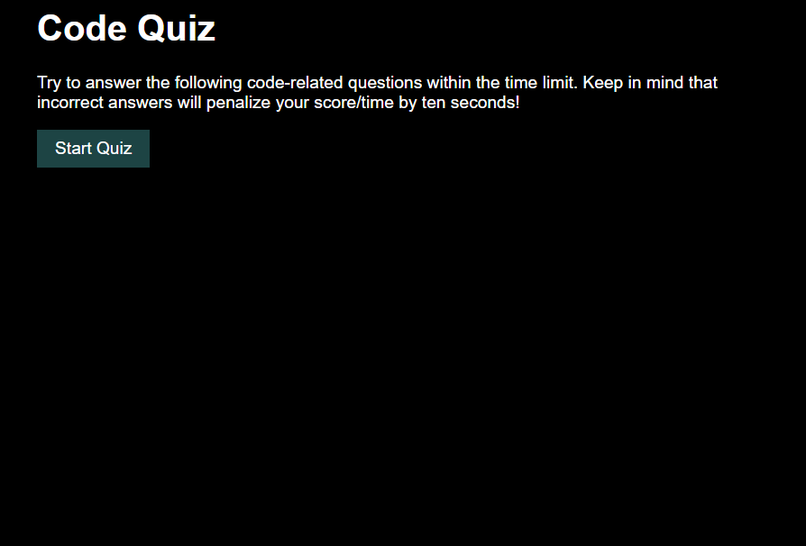

# Challenge 4 Code Quiz

    In this challenge I was tasked to make a quiz with some coding questions. I wanted to demonstrate my knowledge of javascript and saving data in the local storage.


# User Story

```
AS A coding boot camp student
I WANT to take a timed quiz on JavaScript fundamentals that stores high scores
SO THAT I can gauge my progress compared to my peers
```

# Challenges Faced

    Some of the struggle I was facing was getting the click listener to work properly. After some hard look in the code, I realized that some of the classes on my html were not matching with those in JavaScript.

# Screenshots




